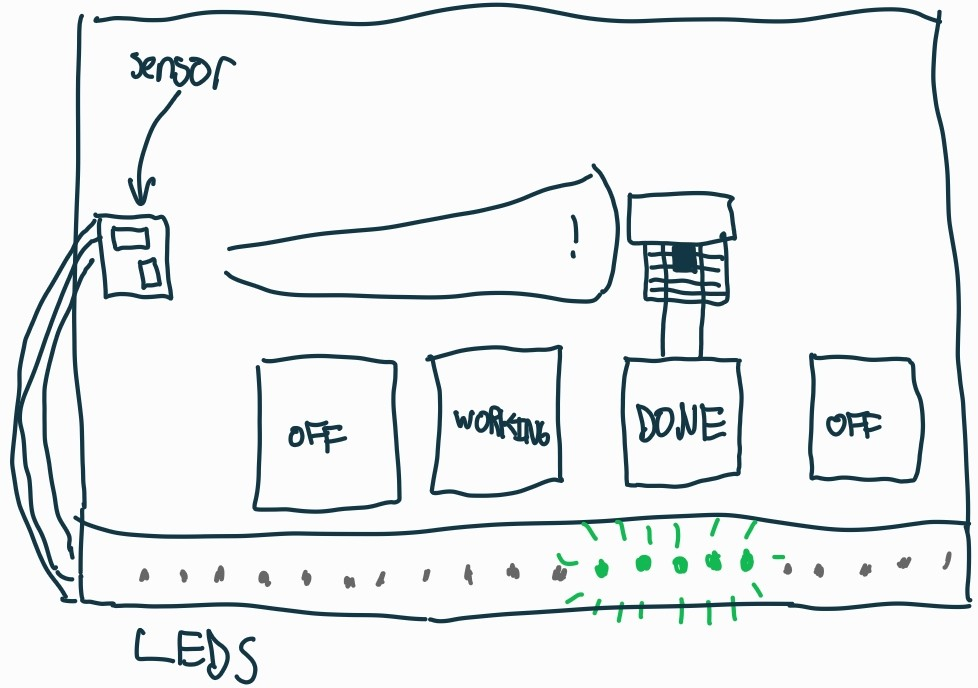

# Formlabs Wash Sensor

This repository contains the firmware and documentation for the Design Innovation Lab's Formlabs Wash Sensor. This device is designed to monitor multiple Formlabs Wash units and visually alert when a wash has completed.

The device uses a distance sensor to measure the position of the wash basket. If the sensor detects the back wall, it assumes the machines are empty or currently working. If it detects an object (the basket/print) consistently, it illuminates a WS2812B LED strip to indicate presence and position, providing visual feedback in busy environments.

## Features

- **Non-Contact Sensing:** Utilizes the VL53L0X time-of-flight distance sensor for measurement. Non-contact sensing avoids mechanical wear and resin contamination. One sensor can monitor multiple wash stations.
- **Visual Feedback:**
  - **Position Tracking:** NeoPixel strip indicates which of the wash stations needs attention based on the distance reading.
  - **Effects:** A "breathing" effect and a bi-directional pulse effect enhance visibility.
- **Noise Filtering:**
  - **Exponential Moving Average (EMA):** Heavily smooths sensor jitter
  - **Hysteresis:** "Sticky" LED positioning prevents flickering between pixels.
- **Smart Presence Detection:** Includes a 15-second delay. The LEDs will not trigger during transient events (like loading or unloading a print). The object must be detected for 15 seconds before the display activates.

## Hardware

- **Microcontroller:** ESP32-C3 "Super Mini" board
- **Sensor:** VL53L0X Time-of-Flight Distance Sensor module
- **Display:** WS2812B Addressable LED Strip

## PCB

A custom PCB was designed to integrate the components neatly and flatly against the wall. The PCB files can be found in the `kicad/` directory. It's simply mounted against the wall using double-sided tape. Nothing special about it, just better than a bunch of wires. Uses Osh Park design rules.

## Configuration

- `WALL_DISTANCE`: The distance from the sensor to the back wall. Readings beyond this turn the system off.
- `FIRST_LED_DISTANCE_OFFSET`: Distance from the sensor to the first LED on the strip.
- `SENSOR_DETECTION_OFFSET`: Compensates for the sensor detecting the front edge of an object while the LEDs should represent the center.
- `LED_SPACING`: Physical distance between LED pixels.
- `PRESENCE_TIMEOUT`: Time an object must be consistently seen before LEDs turn on.
- `FILTER_ALPHA`: Smoothing factor. Lower is smoother but slower.
- `HYSTERESIS_THRESHOLD`: How far the object must move to shift the LED pixel.
